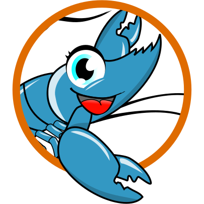

# Gambas3 Syntax Highlight Support

Gambas is a free development environment and a full powerful development platform
based on a Basic interpreter with object extensions, as easy as Visual Basic™.

Read the [Introduction](https://gambaswiki.org/wiki/doc/intro?nh) then this [presentation](https://gambaswiki.org/wiki/doc/whatisgambas?nh) for more information.